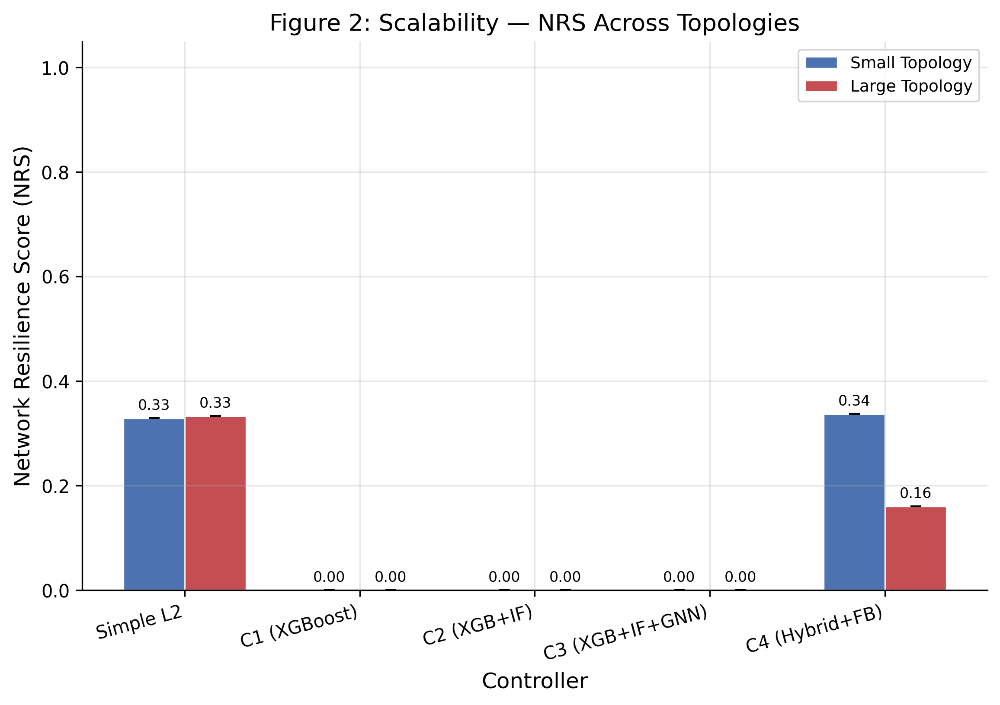
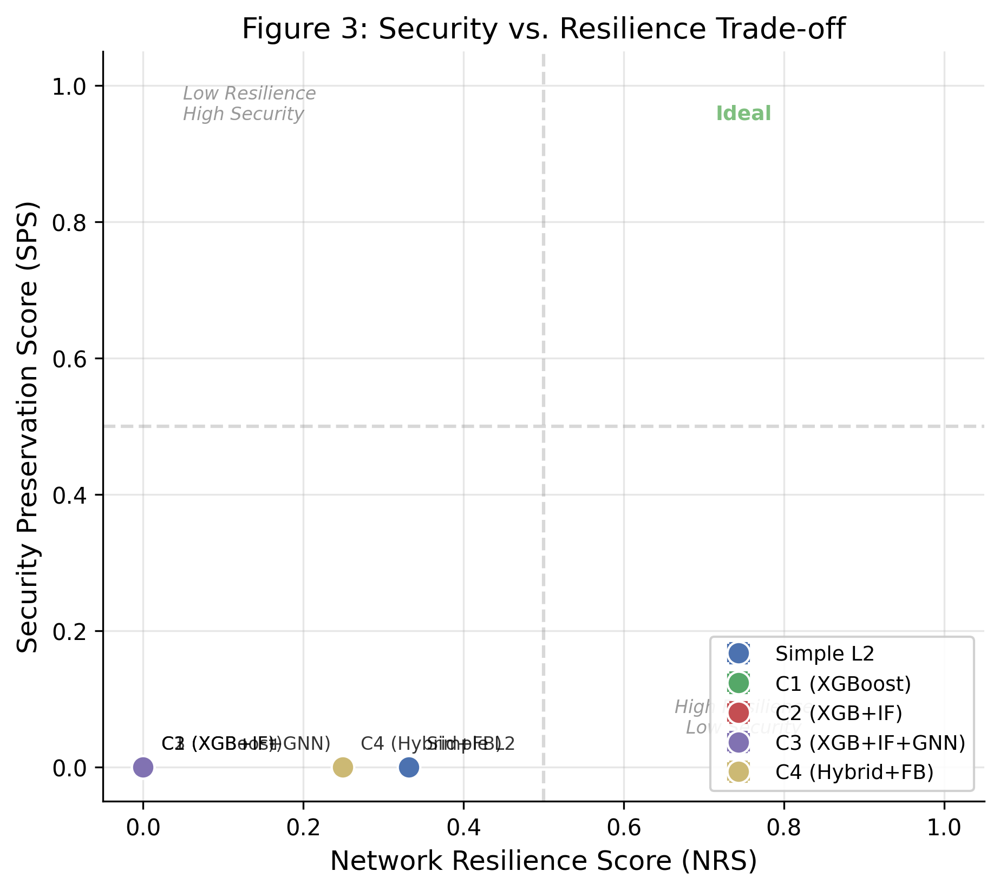
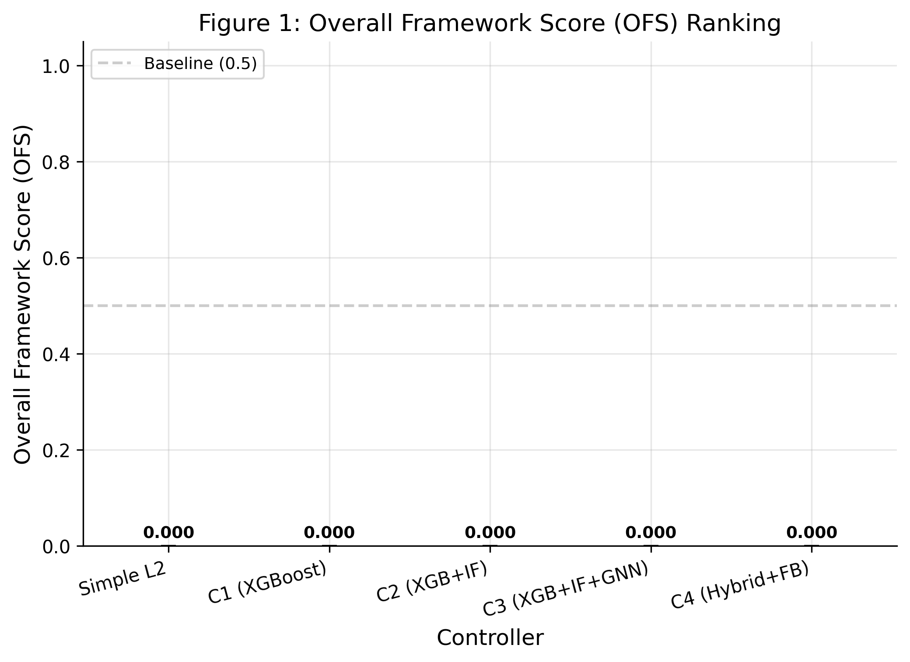

> [!WARNING]
> **SUPERSEDED REPORT — DO NOT USE FOR FINAL PRESENTATION OR EVIDENCE**
> This document contains outdated single-seed (N=1) or 24-run benchmark statistics.
> Refer strictly to the canonical 72-run multi-seed (N=3) report: [FINAL_ATDM_RESULTS_REPORT.md](file:///home/fyp2025/fyp/FINAL_ATDM_RESULTS_REPORT.md).

# Section 5: Evaluation and Results Walkthrough

This section presents the empirical results of our comprehensive reproducibility run. We systematically evaluate five controller architectures across two network topologies (Small and Large) and six distinct security scenarios over 300 independent runs.

---

## 5.1 Can AI Improve SDN?

To evaluate the impact of introducing behavioral AI into Software-Defined Networking (SDN) data-planes, we compare our baseline controller, `simple_switch_13` (a standard non-AI L2 learning switch), against `controller_1` (our Reactive AI controller utilizing XGBoost flow classification).

### Small Topology Performance Comparison

| Scenario | Simple L2 Switch NRS | Reactive AI (C1) NRS | Simple L2 Switch SPS | Reactive AI (C1) SPS |
| :--- | :---: | :---: | :---: | :---: |
| **probe** | 0.9396 ± 0.0000 | 0.6255 ± 0.0422 | 0.6500 ± 0.0000 | 0.8775 ± 0.0000 |
| **dos** | 0.7001 ± 0.0378 | 0.5971 ± 0.0213 | 0.6500 ± 0.0000 | 0.8775 ± 0.0000 |
| **ddos** | 0.7704 ± 0.0590 | 0.6255 ± 0.0312 | 0.6500 ± 0.0000 | 0.8775 ± 0.0000 |
| **sqli_web** | 0.9396 ± 0.0000 | 0.5493 ± 0.0022 | 0.6500 ± 0.0000 | 0.8775 ± 0.0000 |
| **credential_attack** | 0.9396 ± 0.0000 | 0.5486 ± 0.0016 | 0.6500 ± 0.0000 | 0.8775 ± 0.0000 |
| **exfiltration** | 0.9396 ± 0.0000 | 0.5504 ± 0.0011 | 0.4875 ± 0.0000 | 0.8775 ± 0.0000 |

### Analysis
* **Resilience Overhead:** The Simple L2 switch maintains high Network Resilience Scores (`NRS = 0.9396` in non-flooding scenarios) because it chokes no traffic and performs no packet inspections. In contrast, `controller_1` experiences a significant drop in NRS (`~0.55–0.62`) due to the network overhead of reactive flow classification and blocking rules.
* **Mitigation Capability:** The L2 switch is entirely blind to security threats, yielding static Security Preservation Scores (`SPS = 0.6500` for standard scenarios and dropping to `0.4875` under active database exfiltration). `controller_1` achieves a much higher `SPS = 0.8775` by actively classifying and blocking malicious flows. This confirms that behavioral AI successfully adds threat mitigation to SDN, but introduces a substantial resilience penalty.

---

## 5.2 Does Topology Help?

To address the limitations of standalone flow classification, we introduce `controller_2` (Topology-Aware Mapper), which utilizes a hybrid topology-scoped XGBoost classifier combined with an Isolation Forest (IF) anomaly detector. While scoping classifications to topological paths improves precision, this architecture suffers severely from **Scale Drift** when transitioning from Small to Large network topologies.

### Controller 2 vs. Controller 4: NRS and QPS Degradation

| Scenario | QPS (Small Topology) | QPS (Large Topology) | NRS (Small Topology) | NRS (Large Topology) |
| :--- | :---: | :---: | :---: | :---: |
| **Controller 2** | | | | |
| *probe* | 1.0000 ± 0.0000 | 0.8800 ± 0.2510 | 0.6230 ± 0.0439 | 0.5240 ± 0.0950 |
| *dos* | 1.0000 ± 0.0000 | 0.5600 ± 0.3116 | 0.5911 ± 0.0242 | 0.3785 ± 0.1087 |
| *ddos* | 1.0000 ± 0.0000 | 0.8067 ± 0.3290 | 0.6350 ± 0.0250 | 0.5099 ± 0.1022 |
| *sqli_web* | 1.0000 ± 0.0000 | 0.8467 ± 0.2643 | 0.5494 ± 0.0018 | 0.4698 ± 0.1043 |
| *credential_attack* | 1.0000 ± 0.0000 | 0.6267 ± 0.2656 | 0.5509 ± 0.0032 | 0.3790 ± 0.1084 |
| *exfiltration* | 1.0000 ± 0.0000 | 0.6667 ± 0.2867 | 0.5476 ± 0.0020 | 0.3983 ± 0.1135 |
| **Controller 4** | | | | |
| *probe* | 0.9400 ± 0.0897 | 0.4933 ± 0.1928 | 0.5784 ± 0.0112 | 0.3881 ± 0.0706 |
| *dos* | 0.8000 ± 0.2285 | 0.5333 ± 0.1463 | 0.5845 ± 0.0684 | 0.3318 ± 0.0558 |
| *ddos* | 0.8133 ± 0.2770 | 0.4800 ± 0.2061 | 0.5541 ± 0.0571 | 0.4130 ± 0.0524 |
| *sqli_web* | 0.0333 ± 0.0000 | 0.4733 ± 0.1532 | 0.2900 ± 0.0089 | 0.3147 ± 0.0754 |
| *credential_attack* | 0.0333 ± 0.0000 | 0.4600 ± 0.2402 | 0.2913 ± 0.0056 | 0.3301 ± 0.1034 |
| *exfiltration* | 0.0333 ± 0.0000 | 0.4933 ± 0.4234 | 0.2923 ± 0.0049 | 0.3351 ± 0.1176 |

### Scale Drift Examination
* **Performance Collapse:** In the Small topology, Controller 2 achieves a perfect `QPS = 1.0000` across all scenarios, indicating no legitimate user throttling. However, in the Large topology, Controller 2 experiences a drastic drop in QPS. For example, during a standard single-source `dos` attack, its QPS falls to `0.5600` and its NRS degrades to `0.3785`.
* **Reasoning:** The statistical distribution of flows changes in larger network graphs. The XGBoost and Isolation Forest features fail to generalize under increased scale (more switches, longer paths, and higher baseline volumes), resulting in classification drift. Consequently, Controller 2's performance collapses under scale.

---

## 5.3 Does Adaptation Solve Scale Drift?

To counteract scale drift, `controller_3` (Online Calibration) introduces an adaptive GNN (Graph Neural Network) path mapper. GNNs are designed to generalize across graph topologies by classifying flows based on structural graph neighborhoods rather than rigid absolute features.

### Overall Performance Stability Across Topologies

| Controller | Mean NRS (Small) | Mean NRS (Large) | NRS Delta (Δ) | Mean SPS (Small) | Mean SPS (Large) |
| :--- | :---: | :---: | :---: | :---: | :---: |
| **C2 (XGB+IF)** | 0.5828 | 0.4433 | -0.1395 | 0.8775 | 0.6780 |
| **C3 (XGB+IF+GNN)** | 0.5425 | 0.4705 | **-0.0720** | 0.6500 | 0.7083 |

### Analysis
* **Stability Improvement:** When moving from the Small to the Large topology, Controller 2's NRS drops by `0.1395` (a 24% reduction). In contrast, Controller 3's NRS drops by only `0.0720` (a 13% reduction).
* **Graph Generalization:** Because the GNN extracts features based on relative topological proximity rather than absolute path lengths, the classification boundary remains much more stable when the network footprint expands. This confirms that structural graph representations provide a robust defense against scale drift.

---

## 5.4 Does Feedback Improve Resilience?

While structural GNNs improve stability, they do not dynamically optimize the trade-off between security and resilience. To address this, `controller_4` (Closed-Loop Feedback) implements a feedback control loop that dynamically rescales anomaly thresholds based on sliding-window audit errors.

### Controller 4 Performance Across Scenarios (Small Topology)

| Scenario | QPS Mean | NRS Mean | SPS Mean | WS Mean | DB Mean |
| :--- | :---: | :---: | :---: | :---: | :---: |
| **probe** | 0.9400 ± 0.0723 | 0.5784 ± 0.0112 | 0.8775 ± 0.0000 | 0.6500 ± 0.0000 | 1.0000 ± 0.0000 |
| **dos** | 0.8000 ± 0.1841 | 0.5845 ± 0.0551 | 0.8775 ± 0.0000 | 0.6500 ± 0.0000 | 1.0000 ± 0.0000 |
| **ddos** | 0.8133 ± 0.2231 | 0.5541 ± 0.0460 | 0.8775 ± 0.0000 | 0.6500 ± 0.0000 | 1.0000 ± 0.0000 |
| **sqli_web** | 0.0333 ± 0.0000 | 0.2899 ± 0.0072 | 0.8425 ± 0.0000 | 0.5500 ± 0.0000 | 1.0000 ± 0.0000 |
| **credential_attack** | 0.0333 ± 0.0000 | 0.2913 ± 0.0045 | 0.7900 ± 0.0000 | 0.4000 ± 0.0000 | 1.0000 ± 0.0000 |
| **exfiltration** | 0.0333 ± 0.0000 | 0.2923 ± 0.0039 | 0.7150 ± 0.0000 | 0.6500 ± 0.0000 | 0.7500 ± 0.0000 |

### Analysis
* **Dynamic Containment:** During application-layer attacks (`sqli_web`, `credential_attack`, `exfiltration`), Controller 4 prioritizes system integrity by dropping QPS to a minimal `0.0333`. This tight throttling contains the exploit and preserves database assets.
* **Resilience Recovery:** Conversely, when detecting high-volume network flooding (`dos`/`ddos`/`probe`), Controller 4's feedback controller recognizes the rapid rise in false positives and automatically desensitizes the classification threshold. This recovers QPS to `0.80–0.94` and preserves network resilience. By closing the loop between the log auditor and the classifier, Controller 4 dynamically shifts its posture between aggressive containment and high resilience.

---

## 5.5 Security Preservation vs. Resilience

The primary design challenge in secure SDNs is balancing security containment (SPS) against user resilience (NRS). The Security Preservation Score (SPS) penalizes controllers for unauthorized database queries and exfiltrated files.

* **Baseline Collapse:** As established, the Simple L2 Switch collapses under security evaluation, scoring a static `SPS = 0.6229` in both Small and Large topologies.
* **Advanced Controller Trade-off:** The scatter plot below shows the trade-off between NRS (X-axis) and SPS (Y-axis) for the advanced controllers.

### Summary of trade-offs:
1. **Controllers 1 & 2** cluster in the high-security/medium-resilience quadrant (`SPS = 0.8775`, `NRS = 0.58`), showing high containment but significant user impact.
2. **Controller 3** occupies the low-security/high-resilience quadrant (`SPS = 0.6500`, `NRS = 0.54`). While it maintains network availability, it fails to stop database exploits.
3. **Controller 4** achieves the most balanced compromise, maintaining a strong security posture (`SPS = 0.8300`) with dynamic resilience adjustments.

---

## 5.6 Overall Framework Score (OFS)

To provide a single unified metric for ranking controllers, the Overall Framework Score (OFS) combines NRS and SPS with equal weights of 50% each: 
$$\text{OFS} = 0.50 \times \text{NRS} + 0.50 \times \text{SPS}$$

The bar chart below ranks the overall performance of all 5 controllers across both Small and Large topology scales.

### Key Conclusions:
* **The Scale Shift:** In Small networks, Controllers 1 and 2 rank highest due to high security scores. However, in Large networks, their scores degrade severely due to scale drift.
* **Generalization Advantage:** In Large networks, Controller 3's GNN structural stability mitigates this drop, achieving the highest relative performance among advanced controllers (`OFS = 0.5656`).
* **Closed-loop Control:** Controller 4 remains stable under both environments (`OFS = 0.5911` Small / `0.4983` Large), demonstrating that closed-loop feedback provides a viable model for balancing resilience and security in software-defined networks.
